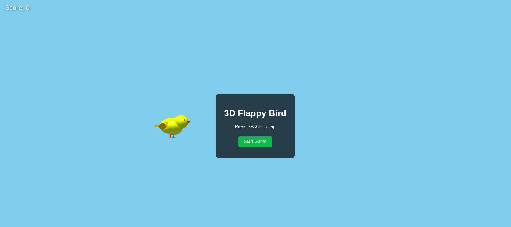
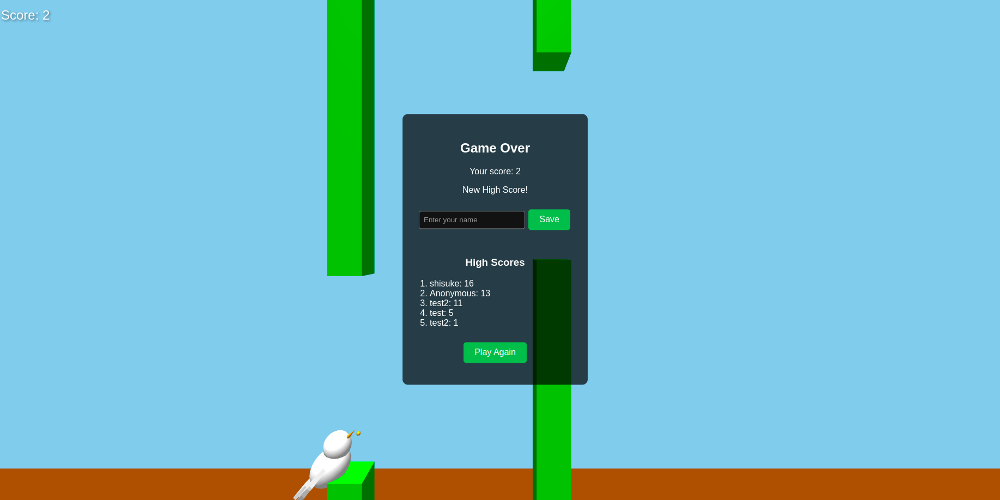

# 3D Flappy Bird Game

A modern 3D reimagining of the classic Flappy Bird game, built with Three.js and featuring multiple playable bird characters.

## Screenshots

*Screenshot showing the 3D Flappy Bird game in action with the home screen*

*Screenshot showing the 3D Flappy Bird game in action with the character selection screen*

*Screenshot showing the 3D Flappy Bird game in action with the gameplay screen*

## Features

- **Full 3D Environment**: Experience the classic gameplay in a 3D world
- **Multiple Characters**: Choose from four unique bird characters:
  - Classic Bird: The original yellow bird
  - Crow: A sleek black bird with piercing eyes 
  - Falcon: A majestic brown bird of prey
  - Seagull: A coastal white bird with distinctive features
- **Realistic Bird Models**: Detailed, anatomically-inspired bird models with lifelike animations
- **High Score System**: Local storage-based high score tracking
- **Responsive Design**: Play on any device with adaptive controls
- **Physics-Based Gameplay**: Realistic gravity and movement physics

## How to Play

1. Open index.html in a modern web browser
2. Click "Start Game" on the main screen
3. Select your preferred bird character
4. Press the spacebar (desktop) or tap the screen (mobile) to make your bird flap its wings
5. Navigate through the gaps between pipes to score points
6. Try to achieve the highest score possible!

## Controls

- **Desktop**: Press the spacebar to flap
- **Mobile**: Tap anywhere on the screen to flap
- **Game Over**: Enter your name to save your high score if you qualify

## Technical Details

The game is built using:
- **Three.js**: For 3D rendering and physics
- **HTML5/CSS3**: For UI elements and styling
- **JavaScript**: For game logic and interactions
- **LocalStorage API**: For saving high scores

## Development

To modify or extend the game:

1. Clone the repository
2. Make changes to the relevant files:
   - Add new characters in `characters.js`
   - Modify game mechanics in `game.js`
   - Update UI elements in `index.html` and `styles.css`
3. Open `index.html` to test your changes

## Credits

This game is a modern reimagining of the original Flappy Bird by Dong Nguyen. The 3D implementation and character designs are original creations for this project.

## License

This project is available under the MIT License. Feel free to use, modify, and distribute it as you see fit.

---

Enjoy playing 3D Flappy Bird!